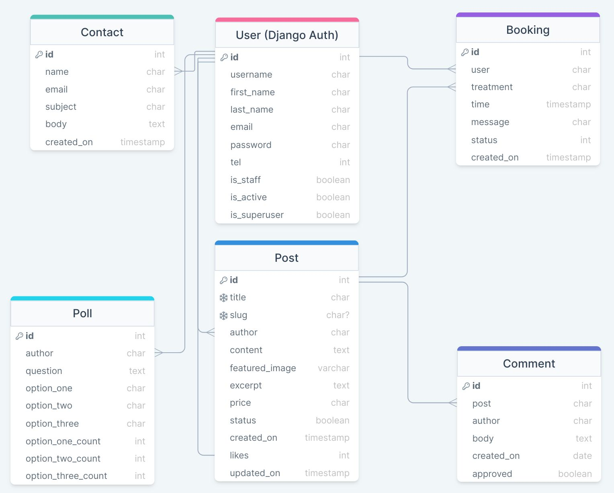
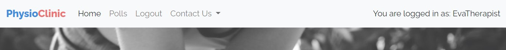
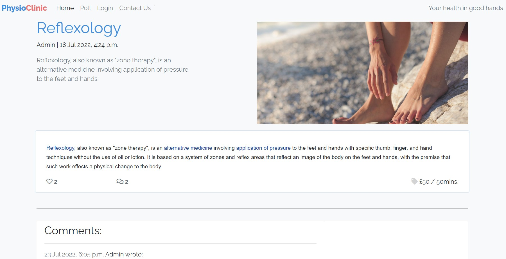

# PhysioClinic

View the live site [here](https://physio-clinic-heroku.herokuapp.com/)

# Table of Contents 

1. [User Experience (UX)](#ux) 
    i.  [Strategy](#strategy) 
    ii. [Scope](#scope) 
    iii. [Structure](#Structure) 
    iv. [Skeleton and technical design](#skeleton) 
    v. [Surface](#surface) 
      
2. [Features](#features) 
    i. [Current Features](#features-existing) 
    ii. [Potential features](#features-next) 

3. [Testing](#testing) 

    i. [User Story / feature testing](#user-story-testing) 
    ii.  [Automated testing](#automated-testing) 
    iii.  [Known issues during development and testing](#known-issues) 
    iv. [Validation testing  ](#validation-testing) 
    v. [Javascript testing](#js-testing) 
    vi. [Unfixed bugs](#unfixed-bugs) 
4. [Deployment](#deployment) 
5. [Technologies Used](#technology-used) 
6. [Credits](#credits) 
7. [Acknowledgements](#acknowledgements) 

## Introduction
**The project concept**

PhysioClinic is the webpage for a fictional Physiotherapy Clinic. 
On this webpage the Owners share information about various kinds of treatments on offer. 
Due to ever-enhancing skills of the Clinic's staff, new staff members joining the Clinic and changing trends among Clients, Staff members have the ability to add, edit and delete cards containing descriptions of treatments. 
Client users of this service can read descriptions and express their attitudes about specific treatments through likes and comments. They may also book treatments and contact the Clinic for general queries.

___

# 1. User Experience (UX)  
### **Project goals**
The main goal of the project is to provide a platform for engaging prospective and current clients interested in using PhysioClinic's offering for enhancing the state of their health. This should be achieved through several sub-goals:
- To enable staff users to post, edit, read and delete content related to company's offering.
- To enable registered users to comment and like specific treatments and read other users' input.
- To enable all users to read about company's offering and see other users' reviews, comments and likes.
- To enable registered users contact the company to book specific treatments.
- To enable all users to contact the company for any reason.

### **Site owner goals**
- To ensure the company's up-to-date offering is broadcast in a timely and efficient manner.
- To increase prospective and current users' interest in the offering and to promote sales through encouraging engagement within the community.
- To maximise customers' retainment.
- To promote knowledge on benefits of treatments on offer.
- To receive requests for booking.
- To enable custommer - company correspondence.
- To build customer database.
- To differenciate between different kinds of users in terms of access and ability to edit and delete information.
- To assure access to the service on different kinds of devices.

### **User goals**
- To be able to use service intuitively and with ease.
- To be able to read content withouth sharing any details.
- To find details on what kinds of treatments are offered and about their benefits.
- To be able to contact the company to book a specific treatment or about other related topics.
- To open and then access account for easier communication.
- To log in and log out as needed.
- To log in with a chosen user name to maintain privacy.
- To have an esthetically pleasing and functionally easy experience while using the webpage.
- To be able give feedback on treatments already received.
- To be able to upload, update and delete information on treatments contained in the posts (for staff users only).

---

## 1.i. Strategy 

## User stories

### **1. Epic: Account management**

1.1 As a **site user** I can **access site without logging in** so that I can **read information about available treatments**.

1.2 As a **site user** I can **register** so that **I have access to personalized service**.

1.3 As a **site user** I can **log in using my username and password** so that I can **access site's enhanced functionality**.

1.4 As a **site user** I can **log out of my account** so that I know **my information stays confidential**.

1.5 As a **site user** I can **easily see my current login status** so that **I know I'm in control of access to my enhanced service on currently used device**.

1.6 As a **site user** I receive **confirmation of logging in and logging out visible on webpage** so that I **instantly know if the operation was successful**.

1.7 As a **staff site user** I can **access enhanced functionality** so that I can **add, edit and delete content on webpage**.

### **2. Epic: Navigation**

2.1 As a **site user** I can **navigate the service intuitively** so that I can **utilize all of its content**.

2.2 As a **site user** I can easily **browse through available treatments** so I can **decide which ones are most appropriate to me**. 

2.3 As a **site user** I can **navigate the site on all kinds of devices** so that **I am not limited to any kind of device**.

### **3. Epic: Customer engagement**

3.1 As a **site user** I can **read and respond to available content** so **my experience on the site feels engaging and interactive**. 

3.2 As a **site user** I can **engage in activities that other users can also participate in** so I can **feel part of a wider community**.

3.3 As a **site user** I can **locate company's social media accounts** so I can **stay in contact through alternative means**.

3.4 As a **site user** I can **use the website for communication with the company** so that I can **send general queries or request booking for a specific treatment**.

3.5 As a **registered site user** I can **use website for communication without having to reenter my details** so that **sending my message requires minimum efford from my side**.

3.6 As a **site owner** I can **control content showing on the website** so that **the whole website content is in line with company values and supports its mission**.

### **4. Epic: Company offer**

4.1 As a **site user** I can **quickly get a general idea about services on offer** so that I can **prioritize which content to read more thoroughly**.

4.2 As a **site user** I can **read thoroughly about chosen treatments** so that I can **acquire content most appropriate to my requirements**.

4.3 As a **site user** I can **respond to content via likes and comments** for **increased sense of community** (registered users only).

4.4 As a **site user** I can **take part in polls and see poll results** so I can **feel more engaged with the company and the health-oriented community**.

4.5 As a **staff site user** I can **create, update and delete polls** so that **polls as means of engaging users and gathering information are used according to their purpose**.

4.6 As a **site owner** I can **easily activate and deactivate content is visible to the public**.

4.7 As a **site owner** I can **prioritize which treatments are showing first on the site** so that I can **influence demand on offering of my choice**. 

### **5. Epic: Site admin**

5.1 As a **site admin** I can **create, update and delete user profiles in admin page** so that **all users have appropriate access to site services**. 

5.2 As a **site admin** I can **create, update and delete posts and comments in admin page** so I can assure that **only content in line with company's ethos and goals is made available**.

5.3 As a **site admin** I can **create, update and delete polls** so that **polls as means of engaging users and gathering information are used according to their purpose**.

5.4 As a **site admin** I can **read, update and delete booking requests** so that **booking requests are dealt with**. 

[Table of Contents](#home)

---

## 1.ii. Scope 

## Strategy trade-offs

Features were evaluated on a scale from 1 to 5 in terms of importance (how important a feature is for the project in current release) and viability (how feasible the implementation of the feature is in current release).

TODO Add strategy trade-offs scr

Click here for strategy trade-offs</summery>

---

## 1.iii. Structure 

## Website templates

Templates are structured into the files listed below. Base template is used for the entire site for consistency and ease in user experience.

TODO Add table with templates.

---

## Code structure

Code is built with utilization of Django framework into apps, files and folders listed below.

### Apps
- accounts - functionality for managing users accounts.
- blog - functionality designed for managing blogs, in this project used to manage posts on treatments being on offer. This includes posts, comments and likes.
- booking - functionality for registered users for receiving requests for treatments on a date and time of user's choice.
- contact - functionality for managing general queries from users.
- poll - functionality for simple polls aiming at gathering ad hoc information on current topics from users and enhancing user engagement.

### Files
Files for running specific apps:
- admin.py - for displaying, creating, modifying and deleting information structured in models with the utilization of native Django admin panel.
- apps.py - includes application configuration for the accounts app.
- forms.py - for preparing and restructuring data, creating forms for the data and receiving and processing submitted forms and data from the user.
- models.py - contain details on every model and attributes.
- urls.py - top level website urls.
- views.py - files holding website's logic, Python functions and classes receiving requests and returning web responses.
- test_forms.py - automated testing for forms. TODO
- test_models.py - automated testing for models. TODO

Common files:
- manage.py - is a command-line utility for executing Django-specific tasks, e.g. starting a new app within the project or running the development server.
- Procfile - used to declare application's process types and entry points, required by Heroku.
- requirements.txt - lists Python libraries installed for the project to work.
- settings.py - settings.
- db.sqlite3 - database used in development.
- README.md - project's documentation.
- TESTING.md - testing documentation. TODO

### Folders
- physioproject - main project for the website.
- app folders: accounts, blog, booking, contact, poll.
- helpers - features not being core of the website, nominally views for rendering 404 and 500 error pages.
- readme - contains files necessary for Readme document to show all of its intended content.
- static - contains all static files, e.g. style.css, in one place for easy access and management.
- templates folder contains html files both supplied with apps and custom-made.

## Data schema

Note:
- User - Post.likes is many-to-many relationship.
- Post.featured_image is a CloudinaryField.

---

## Models
The following models represent the database structure for the website.

### Model: User 
- This model represents a user and is based on Django allauth library.
- This model contains the following fields: username, first_name, last_name, email, password, tel, is_staff, is_active, is_superuser.

Relationships
- It has one-to-many relationship with Contact model (one User can be related to many contact-us messages).
- It has one-to-many relationship with Post model (one user can be related to many posts and many likes).
- It has one-to-many relationship with Booking model (one user can be related to many bookings).

### Model: Post
- Part of blog app.
- This model represents treatments offered by the company.

Relationships
- It has one-to-many relationship with User model.
- It has one-to-many relationship with Booking model (a Post can be related to many Bookings).
- It has one-to-many relationship with Comment model (a Post can be related to many Comments).

Fields and attributes for the Post model

Click here to view Post model - part 1

Click here to view Post model - part 2

Click here to view Post model - part 3

 

### Model: Comment

- Part of blog app.
- This model represents comments registered users can write on treatments.

Relationships
- Comment model has one-to-many relationship with Post model (a post can have many comments)

Click here to view Comment model

 

### Model: Booking 

- Part of booking app.
- Represents requests for appointments for specific treatments registered users can place via the webpage.
- Bookings are ordered by time of creation in descending order.

Relationships
- Booking model has one-to-many relationship with User model (a user can place many booking requests).
- Booking model has one-to-many relationship with Post model (a post/treatment can have many booking requests).

Click here to view Booking model

 

### Model: Contact

- Part of contact app.
- Represents messages all users can send via webpage in Contact Us section.

Relationships
- No relationships set in the Contact model. In ModelContactForm information is pulled about registered user, if available. This offers some benefits of one-to-many relationship with User model combined with flexibility of also serving unregistered users.

Click here to view Contact model

 

### Model: Poll

- Part of poll app.
- Represents questions with options for polls presented to custommers.

Relationships
- Poll model has one-to-many relationship with User model: a user (who must be part of staff) can create many polls.

Click here to view Poll model

 

### Definitions

- ManyToManyField - class used for many-to-many relationships, when a model needs to reference multiple instances of a different model. In an example of blog app, in Post model, a post can be liked by many users and a user can like many posts.
- ForeignKey - class used for one-to-many relationships. ForeignKey is a Django ORM (Object-Relational Mapper) field-to-column mapping for creating and working with relationships between tables in relational databases. In an example of booking app, a post (treatment) can have many bookings but a booking relates only to one post.
- cascade used on on_delete - means that rows in the child table will be deleted when rows in the parent table are deleted.
- CharField - class used for small- to large-sized strings, can have max_length (maximum length) specified. 
- SlugField - class used for creating a slug, which is a short label for something, containing only letters, numbers, underscores or hyphens, generally used in URLs. SlugField can also have Max_length specified.
- unique - when equal True it sets requirement that given key has unique value. In case of slug this is to prevent repeated values hindering post addressing. 
- related_name - is used when one record of a model is related to exactly one record of another model. E.g. author field in the Post model is the same as the ForeignKey it's been given (User model).
- blank - when True this allows field to be left blank, when False field is required to be filled.
- auto_now_add - when True allows to automatically fill the DateTimeField with current date and time.
- BooleanField - allows for true / false statements.
- Meta - class allowing for changing behaviour of the model fields, e.g. setting order in which data is presented.
- verbose_name - allows to alter label accompanying a form field.
- `__str__(self)` -  allows to return an object converted into a string which can be used for the admin page and other purposes. 
- reverse_lazy - is an implementation of the reverse URL resolver, unlike the traditional reverse function, reverse_lazy won't execute until the value is needed. It is useful because it prevents 'Reverse Not Found' exceptions when working with URLs that may not be immediately known, which - in this project - is the case in CreatePost class.

___
## 1.iv. Skeleton 

Layout of the interface, navigation and information design for different screen sizes were planned with utilization of wireframes created in Balsamiq. 

TODO Wireframes from Balsamiq.

___
## Business logic

TODO Describe business logic if needed.

## 1.v. Surface 
The values behind building the webpage for physical therapy clinic are clean simplicity, impecable higiene and friendly, sublte environment. This is reflected in the webpage surface.

### **Colour Palette**
Colour palette reflects the clinic's dedication to hygiene and simplicity. For this purpose pastel colours are used, mainly blue and red with light shades of beige. Blue brings cleanliness and lightness to mind and red is commonly associated with health care while light beige binds them together in a subtle, friendly environment.

Screenshot of colour palette:

### **Typography**

A font chosen for the site had to be light, simple and easy to read to be coherent with the rest of the graphic design. For this purpose I chose font Raleway with fallback font Lato. Both are available from Google Fonts service.

### **Imagery**
Graphics for the site were chosen with the intention of maintaining the theme of a friendly and quiet environment of a physiotherapy practice. Pastelle hues of blue and beige / brown dominate the photos with the exception of the black-and-white hero image aiming to be a welcome accord for the guest. Contrast on the hero photo is slightly lowered to harmonize it with the rest of the site. 

 

Click here to view image 1

Image 1 serves as hero image and a placeholder.

 

Click here to view image 2

 

Click here to view image 3

 

Click here to view image 4

 

Click here to view image 5

 

___

# 2. Features 

## 2.i. Current features 

### **Feature 1. Navigation bar**

Navigation bar is present on top of the screen on all pages of the site. Aim of this feature is that the user always have access to easy navigation across the site without the need to use browser navigation features, e.g. 'back' button.

Navigation bar is responsive to screen size, all buttons are visible on large screens, while on small screens navigation menu is available from the hamburger button. Logo, also serving as a 'home' button is always visible. 

**Responsive design**

Navigation menu is minimized to hamburger button on small screens:

Click here to view image 

 

Navigation menu pulled down from the hamburger menu:
 

Click here to view image 

 

Navigation menu stretched on a larger screen:
 

Click here to view image 

 

**Authorization - dependent navigation**

Navigation menu is dependent on current user profile. Users without login are presented with the simplest menu due to limited authorization. This is visible in Contact Us option. Registered clients have added options of requesting specific treatments "Request appointment":

Navigation bar - unregistered user:

Click here to view image 

 

Contact Us - registered user:

Click here to view image 

 

Users registered as members of staff have additional features available. In menu Poll an additional option 'Create a poll' is available:

Click here to view image 

 

Access to navbar features:

| No. | Feature             | Not logged in | Logged in client | Staff | Admin |
| --- | ------------------- | ------------- | ---------------- | ----- | ----- |
| 1   | Navigation bar      | yes           | yes              | yes   | yes   |
| 2   | Request appointment | no            | yes              | yes   | yes   |
| 3   | Create poll         | no            | no               | yes   | yes   |

 

#### **User Stories related to feature 1**

1.5 As a **site user** I can **easily see my current login status** so that **I know I'm in control of access to my enhanced service on currently used device**.

2.1 As a **site user** I can **navigate the service intuitively** so that I can **utilize all of its content**.

2.3 As a **site user** I can **navigate the site on all kinds of devices** so that **I am not limited to any kind of device**.
 

## **Feature 2: Footer**
The footer is displayed below all other content. Short information about the project and links to company's social media are placed there. Links are available to all users, open in a different tab for easy navigation and contain: 
- Facebook, 
- Instagram,
- Twitter,
- YouTube.

 
Click to view image:

Footer 

 

#### **User Stories related to feature 2**

3.3 As a **site user** I can **locate company's social media accounts** so I can **stay in contact through alternative means**.
 

### **Feature 3. On-site navigation**

**Data creation, edition and deletion**

Access to features and corresponding navigation buttons depends on user authorization. User who is not logged in has access to viewing public information, while other activities in CRUD model are dependant on user profile.

| No. | Feature                                 | Not logged in | Logged in client | Staff | Admin |
| --- | --------------------------------------- | ------------- | ---------------- | ----- | ----- |
| 1   | Reading public information              | yes           | yes              | yes   | yes   |
| 2   | Sending messages to company via webpage | yes           | yes              | yes   | yes   |
| 3   | Requesting specific treatments          | no            | yes              | yes   | yes   |
| 4   | Making comments and likes               | no            | yes              | yes   | yes   |
| 5   | Creating and editing posts and polls    | no            | no               | yes   | yes   |

#### **User Stories related to feature 3**

2.1 As a **site user** I can **navigate the service intuitively** so that I can **utilize all of its content**.

2.2 As a **site user** I can easily **browse through available treatments** so I can **decide which ones are most appropriate to me**. 

2.3 As a **site user** I can **navigate the site on all kinds of devices** so that **I am not limited to any kind of device**.

### **Feature 4. Home page**

On home page user is welcome with a hero picture whose goal is to draw attention and set a scene and mood of the site. In the middle of the hero page is a semi-transparent section with company name and slogan together with a small symbol indicating that more content is available below. To continue on to the content user can click the symbol or scroll down. 

Below the hero image descriptions of available treatments are presented. Each description consists of following components:
- title,
- excerpt,
- main content,
- photo,
- number of likes and comments,
- status (visible only to staff users).
Presentation follows responsive design.

 
Click to view image:

Home screen with hero image 

Home screen on large screen 

Home screen on small screen 

 

#### **User Stories related to feature 4**

3.1 As a **site user** I can **read and respond to available content** so **my experience on the site feels engaging and interactive**. 

4.1 As a **site user** I can **quickly get a general idea about services on offer** so that I can **prioritize which content to read more thoroughly**.

---
### **Feature 5. Account management**
This functionality allows user to register an account, login an logout of the account and change password. 

Click to view image:

Sign in 

 

Users without account may open account online:

Sign up 

 

In case of a failed login attempt an information about incorrect login credentials is shown on page and user can try to login again.

Failed login 

 

User can reset password online:

Password reset 

 

On successful login user is redirected to the main page and shown a temporary confirmation message:

Successful login 

 

When logged in user has easy access to information about their login status:

Login status on large screen 

Login status on small screen 

 

Logged in user can sign out. After signout user is redirected to the main page and temporary confirmation message is shown:

Sign out question 

Sign out confirmation 

 

### Access to account management features
| No. | Feature                 | Not logged in | Logged in client | Staff | Admin |
| --- | ----------------------- | ------------- | ---------------- | ----- | ----- |
| 2   | Sign in                 | yes           | no               | yes   | yes   |
| 3   | Sign out                | no            | yes              | yes   | yes   |
| 4   | Sign up                 | yes           | no               | yes   | no    |
| 6   | Reset password          | yes           | no               | yes   | no    |
| 1   | User account management | no            | no               | no    | yes   |

#### **User Stories related to feature 5**

1.1 As a **site user** I can **access site without logging in** so that I can **read information about available treatments**.

1.2 As a **site user** I can **register** so that **I have access to personalized service**.

1.3 As a **site user** I can **log in using my username and password** so that I can **access site's enhanced functionality**.

1.4 As a **site user** I can **log out of my account** so that I know **my information stays confidential**.

1.5 As a **site user** I can **easily see my current login status** so that **I know I'm in control of access to my enhanced service on currently used device**.

1.6 As a **site user** I receive **confirmation of logging in and logging out visible on webpage** so that I **instantly know if the operation was successful**.

1.7 As a **staff site user** I can **access enhanced functionality** so that I can **add, edit and delete content on webpage**.

---
### **Feature 6. Posts**

In the blog app standard mechanisms of a blog are employed. Each post represents a treatment offered by the company. Posts can be created, edited and deleted by users with staff status. This can be done on the webpage after chosing appropriate button under a post (only visible to staff users) or on admin page by the administrator of the webpage. Users who are not logged in or are logged in as non-staff can see posts with status "live". Staff users can see both "live" and "draft" posts.

**Post list**

All users can view a list of posts with "live status"

Posts - guest 

Posts - guest, small screen

 
Staff users can see both "live" and "draft" posts and add new posts. 

Posts - staff

Posts - staff, small screen

 

**Post details**

Users can click on a treatment title or excerpt to see treatment details, number of likes and comments and comments content.

Each post consists of:
- title
- author and date of creation
- excerpt
- graphic illustration
- main description of treatment
- number of likes (with possibility to add a like for logged in users)
- number of comments
- price
- comments
- add comment form (logged in users)
- edit and delete buttons (staff users)

Functionality available on details page depends on user status: 
- Non-logged in users can view information related to live posts, 
- logged-in users / clients can also engage by liking the treatments and adding comments. 
- Staff users can also edit and delete the treatments, with both live and draft status.

Post details

Post details, small screen

Post details, staff

Post details, staff, small screen

 

### Access to post features

| No. | Feature        | Not logged in | Logged in client | Staff | Admin |
| --- | -------------- | ------------- | ---------------- | ----- | ----- |
| 1   | Create post    | no            | no               | yes   | yes   |
| 2   | Edit post      | no            | no               | yes   | yes   |
| 3   | Delete post    | no            | no               | yes   | yes   |
| 4   | Read post      | yes           | yes              | yes   | yes   |
| 5   | Create comment | no            | yes              | yes   | yes   |
| 6   | Edit comment   | no            | no               | no    | yes   |
| 7   | Delete comment | no            | no               | no    | yes   |
| 8   | Read comment   | yes           | yes              | yes   | yes   |
| 9   | Like a post    | no            | yes              | yes   | yes   |

#### **User Stories related to feature 6**
4.1 As a **site user** I can **quickly get a general idea about services on offer** so that I can **prioritize which content to read more thoroughly**.

4.2 As a **site user** I can **read thoroughly about chosen treatments** so that I can **acquire content most appropriate to my requirements**.

4.3 As a **site user** I can **respond to content via likes and comments** for **increased sense of community** (registered users only).

4.4 As a **site user** I can **take part in polls and see poll results** so I can **feel more engaged with the company and the health-oriented community**.

4.5 As a **staff site user** I can **create, update and delete polls** so that **polls as means of engaging users and gathering information are used according to their purpose**.

4.6 As a **site owner** I can **easily activate and deactivate content is visible to the public**.

4.7 As a **site owner** I can **prioritize which treatments are showing first on the site** so that I can **influence demand on offering of my choice**. 

 

---

### **Feature 7. Poll**

Poll on this website is created with an intent to provide an easy and convenient way for company management to engage with actual and prospective clients and collect information on their views in current matters related to company's business. That information may then be utilized in the decision-making process in the areas like strategy or marketing. 

Poll, guest view

Poll, staff view

Staff has additional option enabling poll creation.

Submit vote

Poll results

Poll creation

### Access to poll features

| No. | Feature      | Not logged in | Logged in client | Staff | Admin |
| --- | ------------ | ------------- | ---------------- | ----- | ----- |
| 1   | View polls   | yes           | yes              | yes   | yes   |
| 2   | Cast vote    | yes           | yes              | yes   | yes   |
| 3   | View results | yes           | yes              | yes   | yes   |
| 4   | Create poll  | no            | no               | yes   | yes   |
| 5   | Edit poll    | no            | no               | no    | yes   |
| 6   | Delete poll  | no            | no               | no    | yes   |

 

#### **User Stories related to feature 7**

3.1 As a **site user** I can **read and respond to available content** so **my experience on the site feels engaging and interactive**. 

3.2 As a **site user** I can **engage in activities that other users can also participate in** so I can **feel part of a wider community**.

4.4 As a **site user** I can **take part in polls and see poll results** so I can **feel more engaged with the company and the health-oriented community**.

4.5 As a **staff site user** I can **create, update and delete polls** so that **polls as means of engaging users and gathering information are used according to their purpose**.

5.3 As a **site admin** I can **create, update and delete polls** so that **polls as means of engaging users and gathering information are used according to their purpose**.

---
### **Feature 8. Direct communication**

#### **Contact us**

Contact Us section consists of two parts:
- General information about the company.
- Contact form users can use to contact the company directly.

This feature is available to all users. When a logged in user wishes to contact the company, fields with name and email address are pre-filled, if this information is available. Otherwise those fields are empty for user to fill. 

Contact Us

 

#### **Booking**

The purpose of the Booking section is to give logged in clients an opportunity to request specific treatments. The form for this mode of communication offers a list of available treatments to choose from and date/time-picker to indicate prefered time of treatment. The fact that no user information is necessary to be filled by the user in this form adds to convenience. 

Booking an appointment

 

### Access to direct communication features

| No. | Feature    | Not logged in | Logged in client | Staff | Admin |
| --- | ---------- | ------------- | ---------------- | ----- | ----- |
| 1   | Contact Us | yes           | yes              | yes   | yes   |
| 2   | Booking    | no            | yes              | yes   | yes   |

#### **User Stories related to feature 8**

3.4 As a **site user** I can **use the website for communication with the company** so that I can **send general queries or request booking for a specific treatment**.

3.5 As a **registered site user** I can **use website for communication without having to reenter my details** so that **sending my message requires minimum efford from my side**.

## 2.ii. Potential features 
Features 
 - Wider array of ways to signup and login, e.g. via social media, Google,
 - Schedule system for employees,
 - Automated booking process,
 - Graphic representation of poll results.

___

 # 3. Testing  

## 3.i. User story testing  

User stories were tested with current features and passed the tests.

[Click here for User story testing](readme/user_story_testing.md)

TODO perform manual tests and fill user_story_testing.md

## 3.ii. Automated testing

[Click here for automated testing](readme/automated_testing.md)

TODO tests

## 3.iii. Known issues during development and testing 

[Click here for Known issues during development and testing](readme/known_issues.md)

TODO tests

## 3.iv. Validation testing:
[Click here for Validation testing](readme/validation_testing.md)

## v. Javascript testing:
[Click for Javascript testing](readme/javascript_testing.md)

## 3.vi. Unfixed Bugs  
No unfixed bugs.
___
# 4. Deployment  
[Click here for Deployment file](readme/deployment.md)

TODO deployment
___
# 5. Technologies used 

## 5.i. Languages libraries and frameworks

**Languages**
- HTML (https://www.w3schools.com/html/)
    - The main laguage this webpage's front-end is running on is HTML (HyperText Markup Language).
- CSS (https://www.w3.org/Style/CSS/)
    - For custom-made styling CSS (Cascading Style Sheets) language was used. 
- JavaScript (https://www.javascript.com/)
    - A limited use of custom-made JavaScript has been employed to enhance functionality of the website.
- Python - within the Django framework Python 3 is the main language used to run its back-end logic. 

**Frameworks, modules and libraries and other tools**

Frameworks and modules
- Django (https://www.djangoproject.com/)
    - This project was built with Django framework.
    - For testing Django unit test was utilized.
- Python modules

    The following modules are used for the project. All modules can be found in requirements.txt file.
    - asgiref==3.5.2
    - cloudinary==1.29.0
    - dj-database-url==0.5.0
    - dj3-cloudinary-storage==0.0.6
    - Django==3.2.13
    - django-allauth==0.51.0
    - django-booking==0.7.2
    - django-bootstrap-datepicker-plus==4.0.0
    - django-bootstrap4==22.1
    - django-cloudinary-storage==0.3.0
    - django-contact-form==2.0.1
    - django-countries==7.3.2
    - django-crispy-forms==1.14.0
    - django-hvad==1.8.0
    - django-libs==2.0.3
    - django-summernote==0.8.20.0
    - django-widget-tweaks==1.4.12
    - gunicorn==20.1.0
    - oauthlib==3.2.0
    - psycopg2==2.9.3
    - PyJWT==2.4.0
    - python3-openid==3.2.0
    - pytz==2022.1
    - requests-oauthlib==1.3.1
    - sqlparse==0.4.2
    - whitenoise==6.2.0
- Bootstrap (https://getbootstrap.com/) - used for consistent layout and responsiveness across all the website.

Version management and deployment
- GitPod (https://gitpod.io/) - used as IDE and the tool for version control in the project.
- GitHub (https://github.com/) - used to maintain repository of the project.
- Heroku (https://www.heroku.com) - used for deployment of the application.

Data storage
- Cloudinary (https://cloudinary.com) - service used for storing and access to dynamic images.
- Postgres (https://www.postgresql.org/) - the deployed project on Heroku uses the Postgres database.
- SQLite (https://www.sqlite.org/) - used as local database.

Validation
- HTML Markup Validation Service (https://validator.w3.org/) - for validating HTML code.
- CSS Validation Service (https://jigsaw.w3.org/css-validator/) - for validating CSS code.
- JSHint (https://jshint.com/) - for validating JavaScript code.
- PEP8 Online Validation Service: (http://pep8online.com) - for validating Python code.
- Unittest (https://docs.djangoproject.com/en/3.2/topics/testing/overview/) - for Python unit testing
- Google Chrome Developer Tools - built-in developer tools used to inspect page elements and help debug issues with the website functionality and layout.

Design stages
- Lucidchart (www.lucidchart.com/) - used to create flowcharts.
- Balsamiq Wireframes(https://balsamiq.com/) - used to create wireframes in the UX design stage.
- SQL DRAW (https://drawsql.app/) – used to create database diagrams.
- Am I Responsive (http://ami.responsivedesign.is/) - Mockup Generator was used to create the Mock up image for this README document.

- Google Fonts (https://fonts.google.com/) - for selecting fonts and using them in the project.
- Font Awesome (https://fontawesome.com/) - all the icons throughout the website are derived from this service.
- Coolors.co (https://coolors.co/) - for generating colour pallette for the website.

Python libraries
Third-party libraries were used for this project:
- request
    - request and response objects are used in Django to pass state through the system.
    - When a page is requested, Django creates an HttpRequest object that contains metadata about the request. Then Django loads the appropriate view, passing the HttpRequest as the first argument to the view function. Each view is responsible for returning an HttpResponse object.
- django
    - from django.apps import AppConfig - AppConfig represents an app for a Django project, including metadata such as name, label and path.
    - from django.contrib import admin - for managing functionality of the admin page.
    - from django import forms - used for Django forms
    - from django.contrib import messages - used for temporary on-screen messages.
    - from django.contrib.auth.tokens import PasswordResetTokenGenerator - used for secure communication.
    - from django.contrib.auth.models import User - for utilizing Django built-in User model functionality.
    - from django.contrib.auth.mixins import LoginRequiredMixin and AccessMixin - for granting access to website's functionality based on user's login status.
    - from django.db import models - for utilizing model structure.
    - from django.shortcuts import render - for rendering a page as a result of running a function.
    - from django.http import HttpResponseRedirect - for redirecting to a page in the process of running a function or a class.
    - from django.shortcuts import redirect - while in case of HttpResponseRedirect the first argument can only be a url, redirect can accept a model, view, or url as it's "to" argument. redirect will ultimately return a HttpResponseRedirect.
    - from django.shortcuts import get_object_or_404 - calls get() on a given model manager, but it raises Http404 instead of the model’s DoesNotExist exception.
    - from django.views import generic, View - generic class-based views designed to display data, in this project posts representing treatments.
    - from django.urls import path - returns an element for inclusion in urlpatterns.
    - from django.urls import include - function that takes a full Python import path to another URLconf module that should be “included” in this place. 
    - from django.urls import reverse_lazy, reverse - the reverse function allows to retrieve url details from urls.py files through the name provided in the path. reverse_lazy is useful for when there is a need to use a URL reversal before your project’s URLConf is loaded (success_url is then used).
    - from django.utils.text import slugify - used for utilizing slug functionality, slug is a short label for something, containing only letters, numbers, underscores or hyphens. They're generally used in URLs, as in this project. 
    - from django.views.generic import TemplateView - for rendering a given template, with the context containing parameters captured in the URL.
    - from django.conf.locale.en import formats as en_formats - for setting date and time formats where local format is not set.
    - from django_contact_form.views import ContactFormView - when utilizing a custom form class, used to manually set up URLs to tell django-contact-form about the form class.

Class-based views provide a way to implement views as Python objects rather than functions.
Class based views were used in this project for the following reasons:
- Code reusability - a view class can be inherited by another view class and modified for a different use case.
- DRY -  help to reduce code duplication
- Code extendability - CBV can be extended to include more functionalities using Mixins
- Code structuring - In CBVs A class based view helps you respond to different http request with different class instance methods instead of conditional branching statements inside a single function based view.
- Built-in generic class-based views
