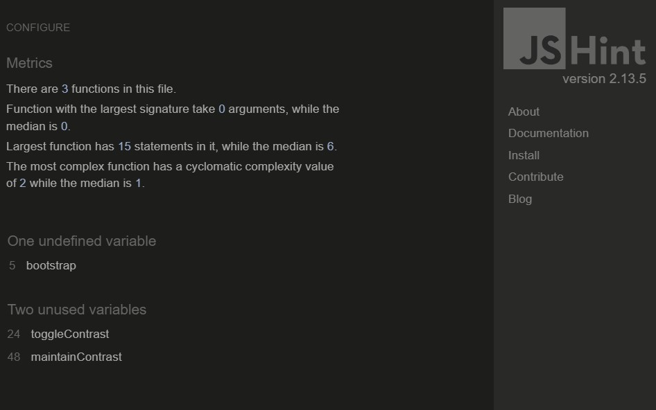

# JavaScript testing

[Click here for Readme file](/README.md#user-story-testing)

All JavaScript for this file is contained in file [script.js](../static/js/script.js).

JavaScript testing has been done with [JS Hint](https://jshint.com/) tool.

JS Hint summary indicated the following potential issues:

- One undefined variable: bootstrap - left as is because bootstrap is referred to outside the scrypt.js file. 
- Two unused variables: toggleContrast, maintainContrast - left as is because these are function names necessary for the code.

    
JS Hint summary

    

