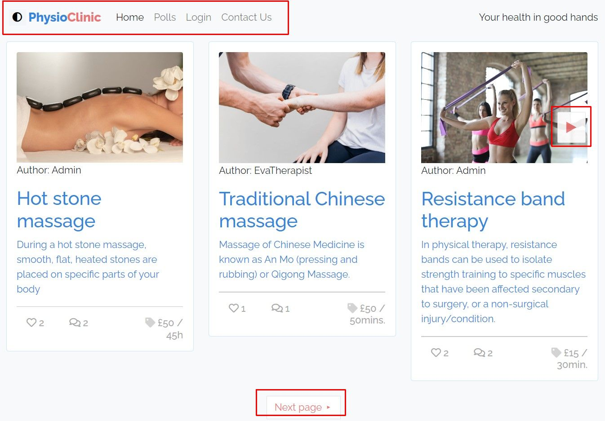

# User story testing

[Click here for Readme file](/README.md#user-story-testing)

All tests have been performed using Google Chrome inspect tools on small, medium and large screen.

## User stories

___
## 1. Epic: Account management

1.1 As a **site user** I can **access site without logging in** so that I can **read information about available treatments**.

Click here to see screenshot

1.2 As a **site user** I can **register** so that **I have access to personalized service**.

Click here to see screenshot

Click here to see screenshot

1.3 As a **site user** I can **log in using my username and password** so that I can **access site's enhanced functionality**.

Click here to see screenshot

1.4 As a **site user** I can **log out of my account** so that I know **my information stays confidential**.

Click here to see screenshot

1.5 As a **site user** I can **easily see my current login status** so that **I know I'm in control of access to my enhanced service on currently used device**.

Click here to see screenshot

1.6 As a **site user** I receive **confirmation of logging in and logging out visible on webpage** so that I **instantly know if the operation was successful**.

Click here to see screenshot

Click here to see screenshot

1.7 As a **staff site user** I can **access enhanced functionality** so that I can **add, edit and delete content on webpage**.

Click here to see screenshot

Click here to see screenshot

Click here to see screenshot

| User story | Feature                               | Action                                                                                                      | Expected result                                                    | Actual result |
|------------|---------------------------------------|-------------------------------------------------------------------------------------------------------------|--------------------------------------------------------------------|---------------|
| 1.1        | Home page, Navbar, Account management | Enter site to see main page or navigate to a subpage by chosing option on navbar                            | Public information is accessible to all users                      | As expected.  |
| 1.2, 1.3   | Account management                    | Click Login on navbar to register or login to see information and functionality appropriate to user profile | Customized information and functionality available to user         | As expected.  |
| 1.4        | Account management, Navbar            | Click Login on navbar and chose logout option                                                               | User logged out, privacy protected after user leaving device       | As expected.  |
| 1.5        | Account management, Navbar            | Login or logout                                                                                             | Current login status shown in top right corner for logged in users | As expected.  |
| 1.6        | Account management                    | User loges in or loges out                                                                                  | Temporary message shows on top of the webpage                      | As expected.  |
| 1.7        | Account management                    | Staff user logges in and choses one of the add/edit/delete options                                          | All changes done by authorized user recorded in database.          | As expected.  |

 

___
## 2. Epic: Navigation

2.1 As a **site user** I can **navigate the service intuitively** so that I can **utilize all of its content**.

Click here to see screenshot

2.2 As a **site user** I can easily **browse through available treatments** so I can **decide which ones are most appropriate to me**.

Click here to see screenshot

2.3 As a **site user** I can **navigate the site on all kinds of devices** so that **I am not limited to any kind of device**.

Click here to see screenshot

| User story | Feature                               | Action                                                                       | Expected result                                                                      | Actual result |
|------------|---------------------------------------|------------------------------------------------------------------------------|--------------------------------------------------------------------------------------|---------------|
| 2.1, 2.2   | Navbar, additional navigation buttons | User choses options in the navigation menu and buttons available on the site | User gets to expected content by chosing options                                     | As expected.  |
| 2.3        | All visual features                   | User views site on various screens                                           | Responsive design makes content available and visually accessive on all screen sizes | As expected.  |

 

___
## 3. Epic: Customer engagement

3.1 As a **site user** I can **read and respond to available content** so **my experience on the site feels engaging and interactive**. 

Click here to see screenshot

3.2 As a **site user** I can **engage in activities that other users can also participate in** so I can **feel part of a wider community**.

Click here to see screenshot

Click here to see screenshot

Click here to see screenshot

3.3 As a **site user** I can **locate company's social media accounts** so I can **stay in contact through alternative means**.

Click here to see screenshot

3.4 As a **site user** I can **use the website for communication with the company** so that I can **send general queries or request booking for a specific treatment**.

Click here to see screenshot

Click here to see screenshot

3.5 As a **registered site user** I can **use website for communication without having to reenter my details** so that **sending my message requires minimum efford from my side**.

Click here to see screenshot

Click here to see screenshot

3.6 As a **site owner** I can **control content showing on the website** so that **the whole website content is in line with company values and supports its mission**.

Click here to see screenshot

Posts with status "draft" are only visible to staff.

Click here to see screenshot

| User story         | Feature                                                 | Action                                                                                                                                                                                    | Expected result                                                                                                     | Actual result |
|--------------------|---------------------------------------------------------|-------------------------------------------------------------------------------------------------------------------------------------------------------------------------------------------|---------------------------------------------------------------------------------------------------------------------|---------------|
| 3.1, 3.2, 3.4, 3.5 | Account, management, Posts, Polls, Direct communication | After loging in user navigates to chosen features: taking part in polls, liking or commenting on posts, sending messages and booking requests.                                            | User can take part in engaging activities: polls, liking, commenting, sending direct messages and booking requests. | As expected.  |
| 3.3                | Footer                                                  | Click on links                                                                                                                                                                            | User opens new window with link to chosen social media account                                                      | As expected.  |
| 3.5                | Home page, Account management, Posts, Polls             | Authorized user can add, edit and delete chosen content. Authorized user can control visibility of posts by changing live/draft status, approve or delete comments, add or delete polls.  | Information shown on site is controlled by authorized users.                                                        | As expected.  |

 

___
## 4. Epic: Company offer

4.1 As a **site user** I can **quickly get a general idea about services on offer** so that I can **prioritize which content to read more thoroughly**.

4.2 As a **site user** I can **read thoroughly about chosen treatments** so that I can **acquire content most appropriate to my requirements**.

4.3 As a **site user** I can **respond to content via likes and comments** for **increased sense of community** (registered users only).

4.4 As a **site user** I can **take part in polls and see poll results** so I can **feel more engaged with the company and the health-oriented community**.

4.5 As a **staff site user** I can **create, update and delete polls** so that **polls as means of engaging users and gathering information are used according to their purpose**.

4.6 As a **site owner** I can **easily activate and deactivate content is visible to the public**.

4.7 As a **site owner** I can **prioritize which treatments are showing first on the site** so that I can **influence demand on offering of my choice**. 

| User story | Feature                                            | Action                                                                                                                                                                                                         | Expected result                                                                           | Actual result |
|------------|----------------------------------------------------|----------------------------------------------------------------------------------------------------------------------------------------------------------------------------------------------------------------|-------------------------------------------------------------------------------------------|---------------|
| 4.1, 4.2   | Home page                                          | Navigate between pages with general information on treatments with buttons on the sides and at the bottom of the page. Click on posts of interest to read expanded information.                                | General information shown on home page, detailed information shown on chosen treatments.  | As expected.  |
| 4.3        | Post detail pages                                  | Login, then click likes, add comments                                                                                                                                                                          | Likes added to posts. Comments added to posts after approval.                             | As expected.  |
| 4.4        | Polls                                              | Click Polls on navbar, see polls, after chosing a poll add vote. View poll results.                                                                                                                            | User sees polls, choses a poll and offers their vote. User sees results.                  | As expected.  |
| 4.5        | Polls                                              | Add a poll. See poll results. Delete a poll.                                                                                                                                                                   | Site owner receives feedback from users on current topics touched in polls.               | As expected.  |
| 4.6        | Home page, detail pages, Polls, Account management | After loging in authorized user can change status of a poll (live – public / draft – visible only to staff), control visibility of comments, add and delete polls. Admin also controls status of other users.  | Visibility of content of the webpage and status of registered users is fully controlled.  | As expected.  |
| 4.7        | Home page                                          | Choose priority of a post when adding or editing.                                                                                                                                                              | Posts are shown in order of priority.                                                     | As expected.  |

 

___
## 5. Epic: Site admin

5.1 As a **site admin** I can **create, update and delete user profiles in admin page** so that **all users have appropriate access to site services**. 

5.2 As a **site admin** I can **create, update and delete posts and comments in admin page** so I can assure that **only content in line with company's ethos and goals is made available**.

5.3 As a **site admin** I can **create, update and delete polls** so that **polls as means of engaging users and gathering information are used according to their purpose**.

5.4 As a **site admin** I can **read, update and delete booking requests** so that **booking requests are dealt with**. 

| User story | Feature            | Action                                                   | Expected result                                                                               | Actual result |
|------------|--------------------|----------------------------------------------------------|-----------------------------------------------------------------------------------------------|---------------|
| 5.1        | Account management | Create, update, delete user profiles via Admin site.     | All user profiles are up to date and with appropriate access to information and functionality | As expected.  |
| 5.2        | Account management | Create, update, delete posts and coments via Admin site. | All content visible to users is in line with company’s ethos and goals.                       | As expected.  |
| 5.3        | Account management | Create, update, delete polls via Admin site.             | Polls are visible to users as needed.                                                         | As expected.  |
| 5.4        | Account management | Read booking requests on Admin site.                     | Bookings read and responded to as needed.                                                     | As expected.  |
