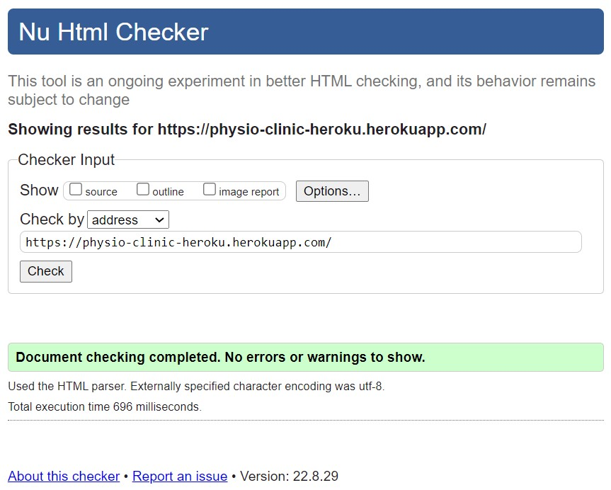
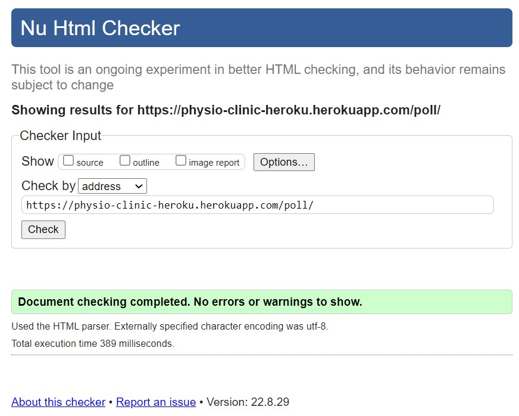
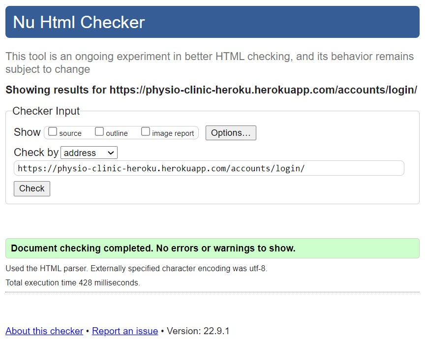
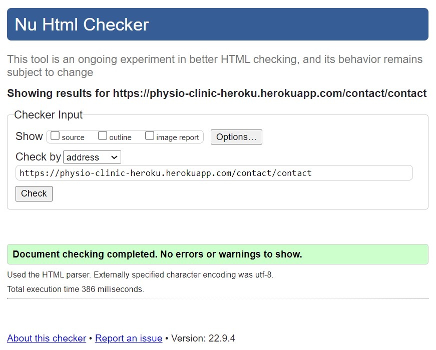
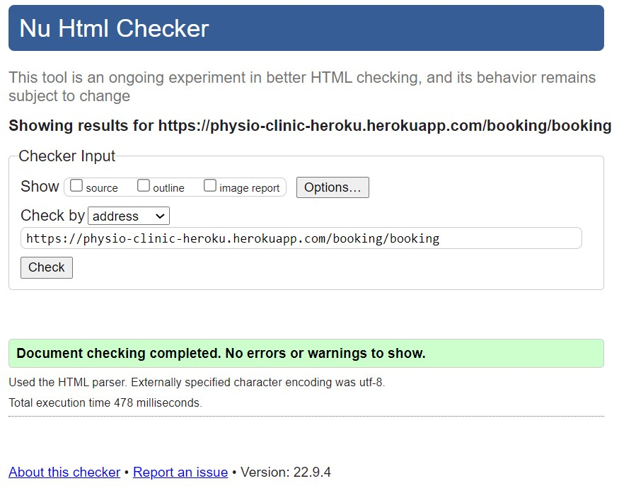

# Validation testing

[Click here for Readme file](/README.md#user-story-testing)

## Validators

The following validators were used for testing code correctness:
### W3C Markup Validator 

No errors or warnings were found by [W3C Markup Validator](https://validator.w3.org/)  throughout the site.

    
Home

    

    
Polls

    

    
Login

    

    
Contact

    

    
Booking

    

 

### W3C CSS Jigsaw Validator

No errors were found by [W3C CSS Jigsaw Validator](https://jigsaw.w3.org/css-validator). Reported warnings are related to Bootstrap and Font Owesome solutions.

    
CSS Validation

    

    
Bootstrap

    

    
Font Owesome

    

