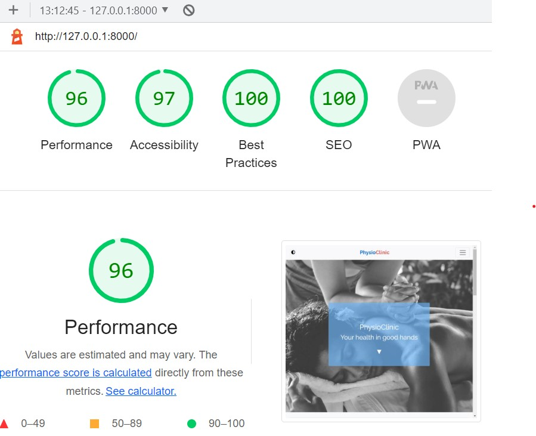

# Validation testing

[Click here for Readme file](/README.md#user-story-testing)

## Validators

The following validators were used for testing code correctness:
### W3C Markup Validator 

No errors or warnings were found by [W3C Markup Validator](https://validator.w3.org/)  throughout the site.

    
Home

    

    
Polls

    

    
Login

    

    
Contact

    

    
Booking

    

    
404

    

 

### W3C CSS Jigsaw Validator

No errors were found by [W3C CSS Jigsaw Validator](https://jigsaw.w3.org/css-validator). Reported warnings are related to Bootstrap and Font Owesome solutions.

    
CSS Validation

    

    
Bootstrap

    

    
Font Owesome

    

 

## User Experience UX testing

### Visibility and functionality
Optimal visibility and functionality on various devices was tested throughout the production process and the finished product was tested using [Responsive Designs](http://ami.responsivedesign.is). Screen from this test is placed in the beginning of this document.

 

### Accessibility
Testing for accessibility of the site was carried out with the employment of [WAVE Web Accessibility Evaluation Tool](https://wave.webaim.org/). Initially contrast errors were found. These errors were addressed by increasing contrast on fonts against background and introducing Contrast toggle button in the top left corner. Switching to increased contrast sets font colours outside original colour scheme but enhances reading comfort for users with such visual needs. This functionality works accross all the website. Alerts were addressed where needed.

    
Home

    

    
Polls

    

    
Login

    

    
Contact

    

    
404

    

 

### Performance
Performance testing was done in [Lighthouse](https://developers.google.com/web/tools/lighthouse), part of the Google Chrome Developer Tools.
 All performance tests ended with score between 90-100.

    
Home

    

    
Polls

    

    
Login

    

    
Contact

    

    
Booking

    

 

### Python code validation

**Pycodestyle**

Pycodestyle validation tool has been used to identify and remedy errors in Python code with special attention to *unused variables* and *unused imports*.

Setup for pycodestyle validation in contained in [setup.cfg](../setup.cfg) file.

    
Results

    

 

**Pylint**

Pylint validation tool has been used to identify and remedy errors in Python code with special attention to *missing docstrings*.

Setup for pycodestyle validation in contained in [.pylintrc](../.pylintrc) file.

Ignored positives in this project:

- Unused import env error - has been ingrored as the code works correctly and is necessary for importing from env.py file 

    
Unused import env

    

- Too few public methods - ignored for consistency of the code among its various apps. This way even though the Poll form in CreatePollForm class is simpler than other forms in the project, it still utilizes the same mechanisms as the more complex ones.