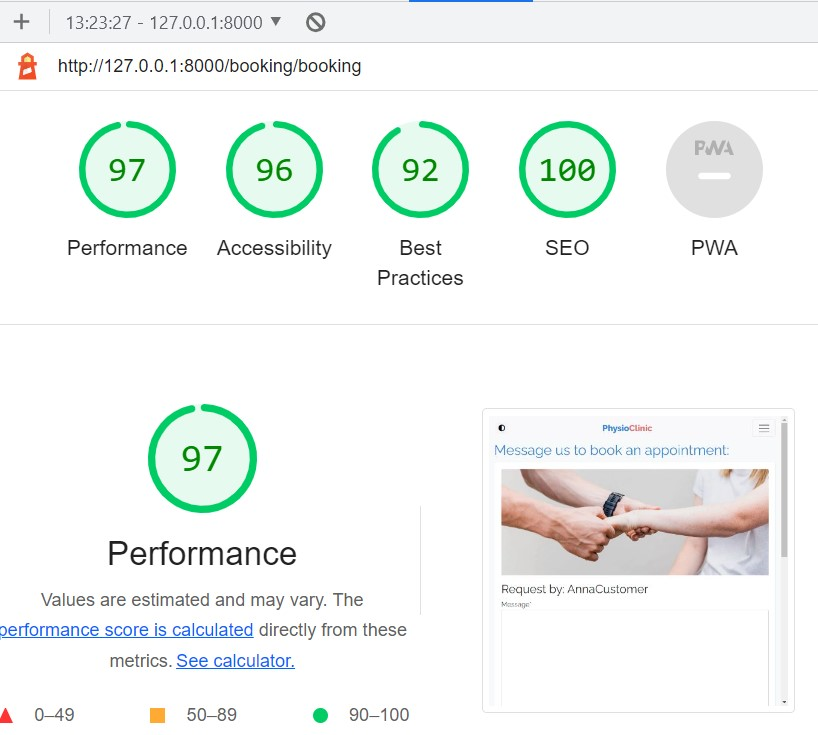

# Validation testing

[Click here for Readme file](/README.md#user-story-testing)

## Validators

The following validators were used for testing code correctness:
### W3C Markup Validator 

No errors or warnings were found by [W3C Markup Validator](https://validator.w3.org/)  throughout the site.

    
Home

    

    
Polls

    

    
Login

    

    
Contact

    

    
Booking

    

    
404

    

 

### W3C CSS Jigsaw Validator

No errors were found by [W3C CSS Jigsaw Validator](https://jigsaw.w3.org/css-validator). Reported warnings are related to Bootstrap and Font Owesome solutions.

    
CSS Validation

    

    
Bootstrap

    

    
Font Owesome

    

 

## User Experience UX testing

### Visibility and functionality
Optimal visibility and functionality on various devices was tested throughout the production process and the finished product was tested using [Responsive Designs](http://ami.responsivedesign.is). Screen from this test is placed in the beginning of this document.

 

### Accessibility
Testing for accessibility of the site was carried out with the employment of [WAVE Web Accessibility Evaluation Tool](https://wave.webaim.org/). No errors were found. Alerts were addressed where needed.

    
Home

    

    Web accessibility alerts indicated a repeated links. These are important for optimal user experience in this case.

    
Campervans

    

    Alerts related to Campervans page indicated to repeated alternative texts in carousel. This is due to similar nature of images in the carousel.

    
Garage

    

    
FAQ

    

    
Contact

    

    
404

    

 

### Performance
Performance testing was done in [Lighthouse](https://developers.google.com/web/tools/lighthouse), part of the Google Chrome Developer Tools.
 All performance tests ended with score between 90-100.

    
Home

    

    
Polls

    

    
Login

    

    
Contact

    

    
Booking

    

